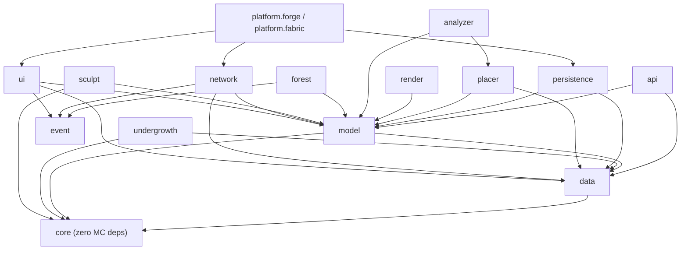
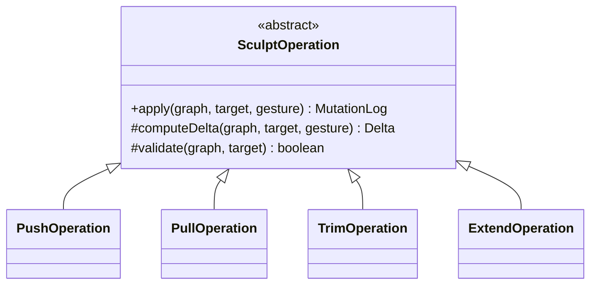
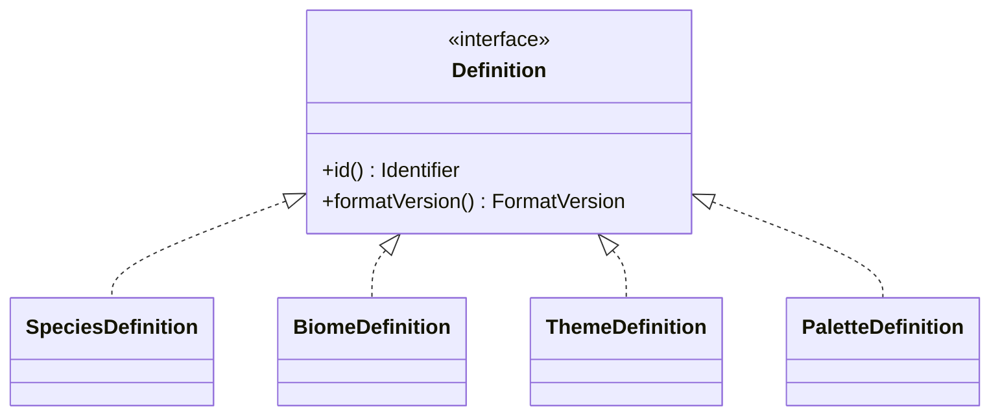
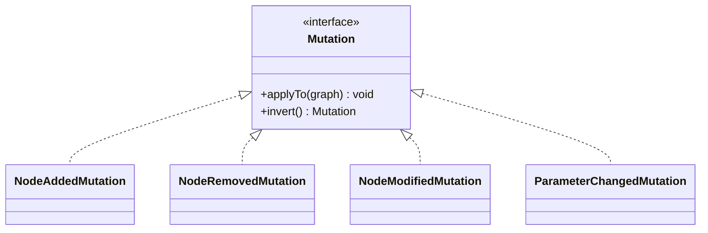
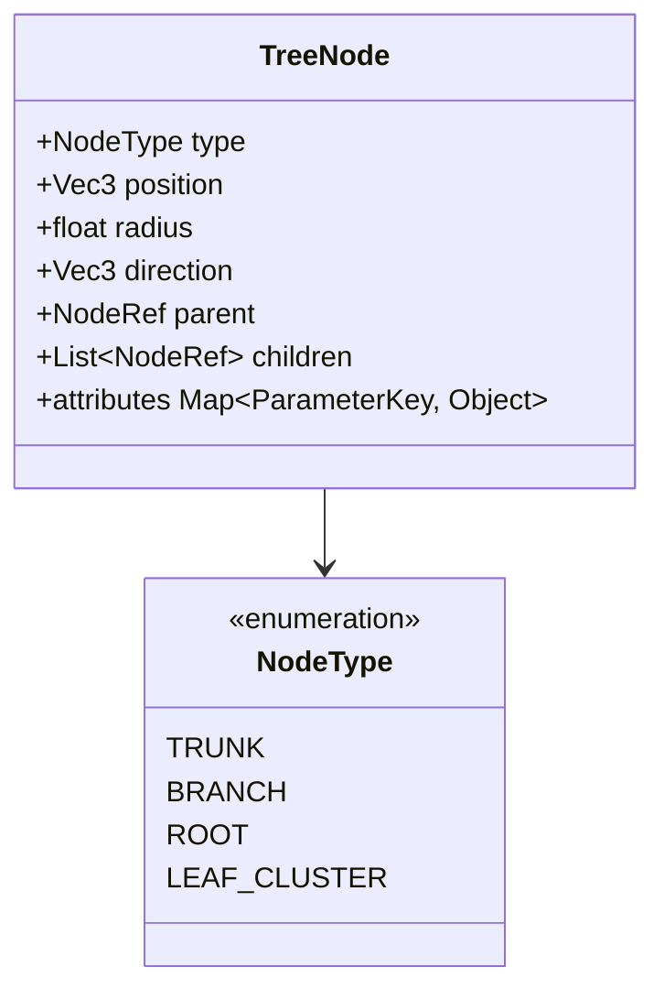
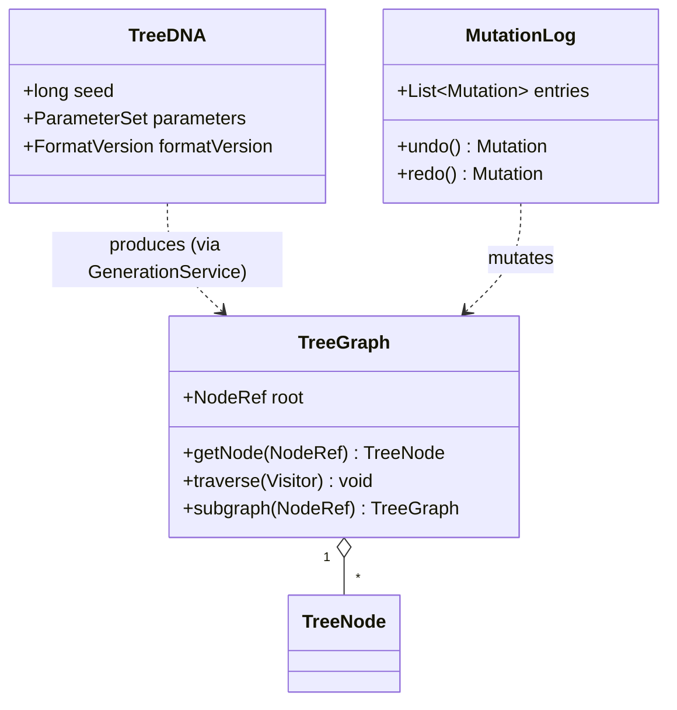
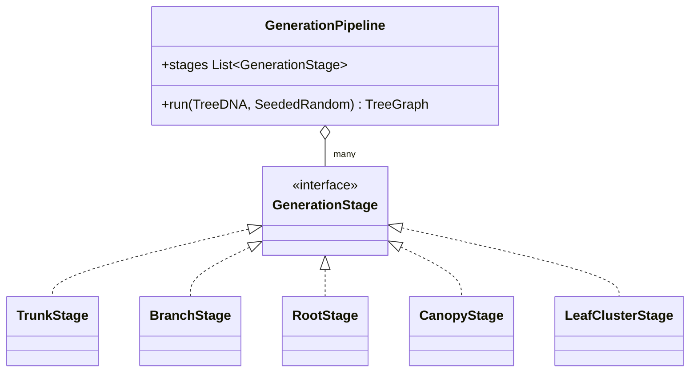
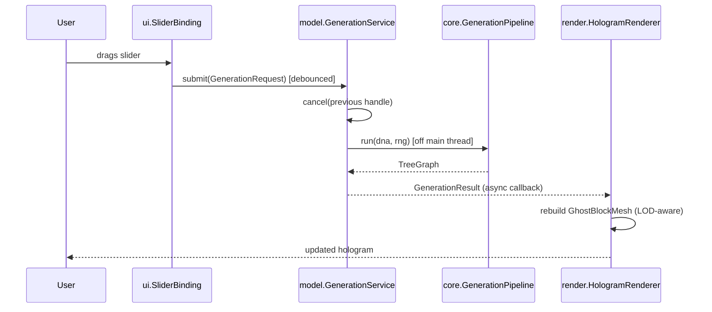
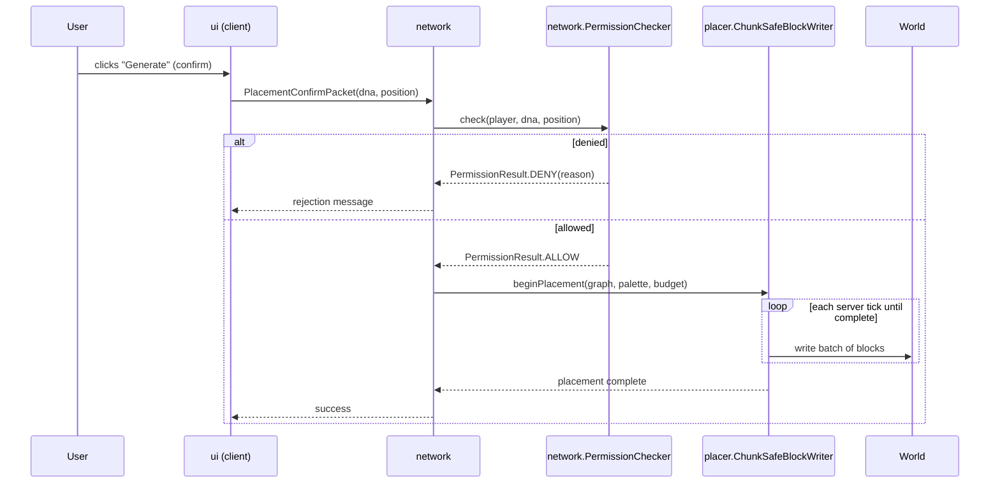
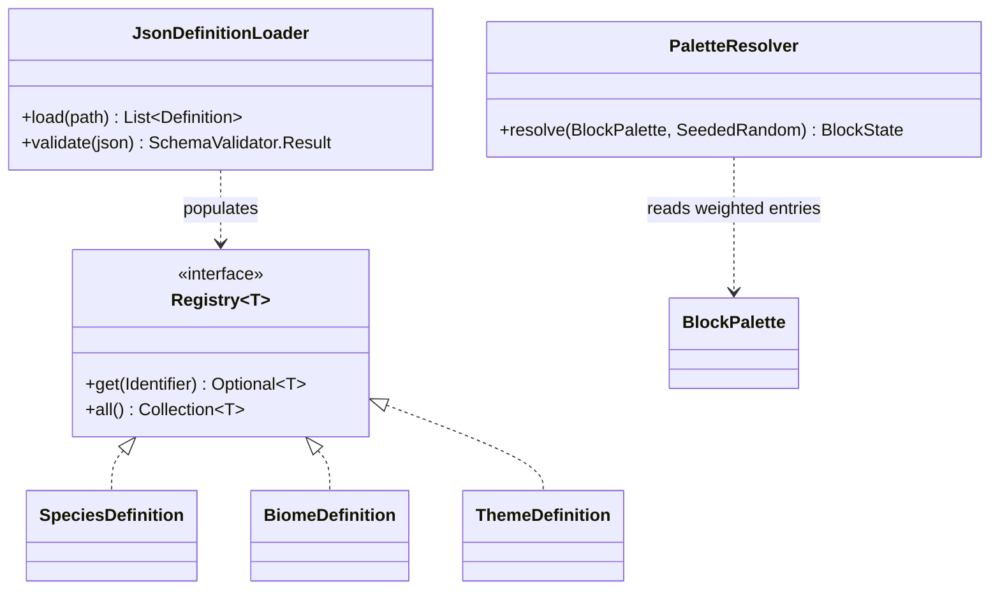

# Tree Studio — Internal Architecture Design

This document goes one level deeper than the module-level design: package structure, class-level responsibilities, interfaces, class hierarchies, and communication diagrams. Every decision is explained — the goal is that anyone reading this could implement a module in isolation and have it integrate correctly.

Notation: interfaces are written in Java-like pseudocode (signatures only, no bodies) since this is what the eventual codebase will look like. Diagrams are written in Mermaid syntax.

---

## 1. Package Structure

Each top-level module from the previous document maps to one Gradle subproject and one root package. Sub-packages are organized **by responsibility, not by type** (no `dto/`, `util/`, `manager/` dumping grounds) — this keeps related classes discoverable together and makes module boundaries obvious from the package name alone.

```
com.treestudio
│
├── core                        (L1 — pure algorithms, zero MC deps)
│   ├── math                    Vec3, Curve, Spline, NoiseField
│   ├── random                  SeededRandom (wraps a splittable RNG)
│   └── generation               
│       ├── stage               GenerationStage impls (Trunk, Branch, Root, Canopy, Leaf)
│       └── pipeline             GenerationPipeline, PipelineBuilder
│
├── model                       (L2 — the IR, the shared contract)
│   ├── tree                    TreeGraph, TreeNode, NodeType, NodeRef
│   ├── dna                     TreeDNA, ParameterSet, ParameterKey
│   ├── mutation                Mutation, MutationLog, MutationType
│   └── service                 GenerationService, GenerationRequest,
│                                GenerationHandle, GenerationResult
│
├── data                        (L3 — registries, definitions, JSON)
│   ├── registry                Registry<T>, RegistryKey, Identifier
│   ├── definition               Definition (common interface)
│   │   ├── species              SpeciesDefinition
│   │   ├── biome                BiomeDefinition
│   │   └── theme                ThemeDefinition
│   ├── palette                 BlockPalette, WeightedEntry, PaletteResolver
│   └── loader                  JsonDefinitionLoader, SchemaValidator
│
├── render        (client only, L4)
│   ├── hologram                 HologramRenderer, GhostBlockMesh, PreviewSession
│   └── lod                      LodPolicy, DistanceCuller
│
├── placer                      (L4)
│   ├── mapping                  IrToBlockStateMapper
│   └── write                    ChunkSafeBlockWriter, BlockChangeSet, WriteBudget
│
├── sculpt                      (L5)
│   ├── operation                SculptOperation (+ Push/Pull/Trim/Extend)
│   └── resolve                  PartialRegenerationResolver
│
├── persistence                 (L5)
│   ├── blueprint                Blueprint, BlueprintSerializer
│   └── format                   FormatVersion, BlueprintMigrator
│
├── network                     (L5)
│   ├── packet                   GenerationRequestPacket, PlacementConfirmPacket
│   └── permission               PlacementPermissionChecker, PermissionResult
│
├── ui             (client only, L5)
│   ├── screen                   GeneratorScreen, PanelController
│   └── widget                   SliderBinding, PaletteEditorWidget
│
├── event                       (cross-cutting)
│   └── bus                      EventBus, TreeStudioEvent (+ subtypes)
│
├── undergrowth                 (v1.5 — reuses core.generation patterns)
├── forest                      (v2.0 — orchestrates model.service at scale)
├── analyzer                    (v2.0 — L4→L2 reverse pipeline)
│
├── api                         (public extension surface, L2/L3 stable subset)
│
└── platform
    ├── forge                    (L6)
    └── fabric                   (L6)
```

**Design decision:** `render` and `ui` are the only client-only packages; everything else (including `placer`, which writes real blocks) is common/server-safe code. This mirrors Minecraft's own client/server split and avoids the common modding mistake of accidentally pulling client-only classes into server logic, which crashes dedicated servers. Keeping this separation at the *package* level (not just convention) lets you enforce it later with module boundaries (Java Platform Module System or Gradle source sets) rather than trusting developer discipline.

---

## 2. Module Responsibilities (Class-Level)

| Package | Key Classes | Responsibility |
|---|---|---|
| `core.generation.stage` | `GenerationStage` (interface) + implementations | Each stage does exactly one job: grow a trunk path, branch off it, spread roots, shape a canopy, place leaf clusters. Stateless, pure functions of `(TreeGraph, TreeDNA, SeededRandom) → TreeGraph`. |
| `core.generation.pipeline` | `GenerationPipeline` | Orders stages, runs them sequentially (or in parallel where a dependency graph allows), and is itself the only thing `core` exposes publicly. |
| `model.tree` | `TreeGraph`, `TreeNode` | The IR itself: a graph of nodes with parent/child links, positions, radii, directions, and a `NodeType`. This is what every other module reads or writes. |
| `model.dna` | `TreeDNA` | The complete, serializable parameter set that deterministically produces a `TreeGraph` given a seed. This is the thing that gets saved to a Blueprint — not the graph itself (see §7 on why). |
| `model.mutation` | `Mutation`, `MutationLog` | Records every change to a `TreeGraph` or `TreeDNA` as an invertible command. Backing store for undo/redo. |
| `model.service` | `GenerationService` | The **only** entry point that turns a `GenerationRequest` into a `TreeGraph`. Owns cancellation, threading, and debouncing. UI, sculpt, persistence, and forest all go through this — none of them call `core` directly. |
| `data.registry` | `Registry<T>` | Generic, data-driven lookup table for any `Definition` (species/biome/theme/palette). Backed by JSON, hot-reloadable. |
| `render.hologram` | `HologramRenderer`, `PreviewSession` | Subscribes to `GenerationService` results and renders ghost blocks. Owns its own LOD/culling — never touches world state. |
| `placer.write` | `ChunkSafeBlockWriter` | Converts a confirmed `TreeGraph` into real block writes, budgeted across ticks, chunk-load aware, cancellable if the area unloads. |
| `sculpt.operation` | `SculptOperation` hierarchy | Encapsulates one interactive edit gesture. Produces a `MutationLog` fragment and triggers a *partial* re-invocation of `GenerationService` for the affected subgraph only. |
| `persistence.blueprint` | `Blueprint`, `BlueprintSerializer` | Wraps a `TreeDNA` + metadata (`FormatVersion`, author, thumbnail seed) for save/load/share. |
| `network.packet` | packet classes | Thin, versioned DTOs carrying `GenerationRequest`/`TreeDNA` between client and server. Never carries raw block data for preview. |
| `api` | stable interfaces only | The subset of `model`/`data` interfaces that external mods/datapacks are allowed to depend on, frozen against breaking changes independent of internal refactors. |

---

## 3. Dependency Graph



**Design decision — why this shape matters:** notice `core` has **zero incoming knowledge** of anything above it, and `model` is the most-depended-upon package in the whole project. This is intentional: `model` (the IR) is the stable contract. Everything else — renderer, placer, sculptor, persistence, network, even the future analyzer — depends *on* the IR but never on each other directly. If you drew an arrow between `render` and `placer`, that would be a violation worth catching in code review; the fact that the graph above has no such arrow is the whole point of the architecture. It's what guarantees hologram and final placement can never visually diverge — they're both just readers of the same `TreeGraph`.

The one deliberately-allowed "backward-looking" dependency is `analyzer → placer`: the analyzer reuses the placer's block↔IR mapping tables in reverse (see §8), which is cheaper than duplicating that knowledge, at the cost of a slightly unusual dependency direction — acceptable since `analyzer` is a v2.0 leaf module nothing else depends on.

---

## 4. Core Interfaces

Signatures only — no logic. Grouped by package.

### `core.generation.stage.GenerationStage`

```java
public interface GenerationStage {
    // Pure function: same inputs always produce the same output graph.
    TreeGraph apply(TreeGraph input, TreeDNA dna, SeededRandom rng);

    // Declares which prior stages must run first, so the pipeline
    // can parallelize independent stages (e.g. Root and Canopy
    // both only depend on Trunk+Branch, not on each other).
    Set<StageId> dependsOn();

    StageId id();
}
```
**Decision:** stages declare dependencies rather than being hardcoded into a fixed order. This is what makes `undergrowth` (v1.5) able to reuse the same pipeline machinery for bushes/ferns without touching `core.generation.pipeline` — it just registers new stages.

### `model.service.GenerationService`

```java
public interface GenerationService {
    GenerationHandle submit(GenerationRequest request);
    void cancel(GenerationHandle handle);
    GenerationHandle resubmitPartial(GenerationHandle handle, NodeRef subgraphRoot, TreeDNA patchedDna);
}
```
```java
public interface GenerationHandle {
    CompletionStage<GenerationResult> result(); // async, never blocks caller
    boolean isCancelled();
}
```
**Decision:** `resubmitPartial` exists as a first-class method, not a workaround. Sculpt operations and slider-drag preview updates both need "regenerate only this part" — making it explicit here means neither `sculpt` nor `ui` needs to know *how* partial regeneration works, only that it's a supported request shape.

### `data.registry.Registry<T extends Definition>`

```java
public interface Registry<T extends Definition> {
    Optional<T> get(Identifier id);
    Collection<T> all();
    void register(T definition);   // used by loader and by external mods via api
    boolean isDataDriven();        // true for JSON-backed, false for built-ins
}
```

### `placer.write.ChunkSafeBlockWriter`

```java
public interface ChunkSafeBlockWriter {
    PlacementHandle beginPlacement(TreeGraph graph, BlockPalette palette, WriteBudget budget);
    void tick(PlacementHandle handle); // called once per server tick until complete
    void cancel(PlacementHandle handle);
    boolean isComplete(PlacementHandle handle);
}
```
**Decision:** placement is explicitly tick-driven rather than a single blocking call, because a fully-grown ancient jungle tree can be thousands of block writes — doing that synchronously on the server thread is a lag spike waiting to happen. `WriteBudget` (max blocks/tick) is a parameter, not a constant, so server owners can tune it per §2 of the previous document's "missing features."

### `sculpt.operation.SculptOperation`

```java
public interface SculptOperation {
    MutationLog apply(TreeGraph graph, NodeRef target, Vec3 gesture);
    NodeRef affectedSubgraphRoot(); // hands this to GenerationService.resubmitPartial
}
```

### `model.mutation.Mutation`

```java
public interface Mutation {
    void applyTo(TreeGraph graph);
    Mutation invert(); // every mutation must know how to undo itself
}
```
**Decision:** the Command pattern here is what makes undo/redo trivial and *uniform* across generation, sculpting, and (eventually) forest edits — there is exactly one undo mechanism in the whole codebase, not three bespoke ones per subsystem, directly resolving the "distinguish undo stacks" gap flagged earlier. (The three conceptual undo *stacks* — generation, sculpt, placement — still exist, but they're all built from this one `Mutation` primitive rather than three separate implementations.)

### `persistence.blueprint.BlueprintSerializer`

```java
public interface BlueprintSerializer {
    Blueprint serialize(TreeDNA dna, BlueprintMetadata meta);
    Blueprint deserialize(byte[] data) throws UnsupportedFormatVersionException;
    Blueprint migrate(Blueprint old, FormatVersion target);
}
```

### `api` (public extension surface)

```java
public interface TreeStudioApi {
    Registry<SpeciesDefinition> species();
    Registry<BiomeDefinition> biomes();
    Registry<ThemeDefinition> themes();
    GenerationHandle requestGeneration(GenerationRequest request);
}
```
**Decision:** this is a deliberately narrow facade over `model` and `data` — external mods get registries and a generation entry point, nothing else. They cannot reach `core`, `render`, or `placer` directly. This is what lets internal implementation (e.g. swapping the branching algorithm) change freely without breaking third-party datapacks, satisfying the "extensibility" gap from the previous document without exposing internals.

---

## 5. Class Hierarchies

Three genuine inheritance hierarchies exist in this design. Everywhere else, composition + interfaces are preferred (explained below).

### 5.1 `SculptOperation` hierarchy — Template Method


**Decision:** real inheritance is justified here because all four operations share identical *structure* (validate target → compute a geometric delta → wrap it as a logged mutation) and differ only in the delta computation. `apply()` is implemented once in the abstract base as a template method; subclasses only override `computeDelta`. This avoids four copies of validation/logging logic.

### 5.2 `Definition` hierarchy — shared identity, no shared behavior


**Decision:** this is an *interface*, not an abstract class, and deliberately thin. Species/Biome/Theme don't share behavior — they share only the need to be registrable, identifiable, and versioned. Forcing them into a common abstract base class with shared fields would create coupling between concepts that are supposed to be independently combinable (recall: Oak × Savanna × Fantasy is a *combination* of three orthogonal definitions, not an inheritance relationship — modeling it as inheritance would be a category error).

### 5.3 `Mutation` hierarchy — Command pattern


**Decision:** `NodeAddedMutation.invert()` returns a `NodeRemovedMutation` and vice versa — the pairing is enforced by interface contract, not convention. Kept as an interface (not abstract class) because, unlike `SculptOperation`, these truly have no shared implementation to hoist up — only a shared contract.

### 5.4 Where inheritance was deliberately *avoided*

`TreeNode` is **not** subclassed into `TrunkNode`/`BranchNode`/`RootNode`/`LeafClusterNode`. Instead it's a single concrete class with a `NodeType` enum field plus a small `Map<ParameterKey, Object>` of type-specific attributes.


**Why composition over inheritance here specifically:** a `TreeGraph` may contain tens of thousands of nodes for a large tree, and generic graph algorithms (traversal, pruning, LOD culling, serialization) need to treat all nodes uniformly regardless of type. A polymorphic hierarchy would force either (a) instanceof-checking/downcasting everywhere graph algorithms touch nodes — defeating the purpose of polymorphism — or (b) virtual dispatch overhead on every node visit during hot-path generation and rendering. A flat class with a type tag serializes trivially (important for `persistence`), is cheap to allocate in bulk, and keeps every generic algorithm in `core`/`model` type-agnostic. This is the single biggest performance-vs-purity tradeoff in the design, made deliberately in favor of performance since it sits directly in the real-time preview hot path.

---

## 6. UML Diagrams

### 6.1 Core IR structure



### 6.2 Generation pipeline (Strategy + Chain)



### 6.3 Sequence — live hologram preview on slider change


**Why this matters as a diagram:** it makes explicit that the UI never blocks and never calls generation synchronously — the debounce + cancel-previous step is what keeps rapid slider dragging from queuing up dozens of stale generations.

### 6.4 Sequence — confirm & place (client/server authority)


**Design decision, restated concretely:** the hologram (client-authoritative, instant, cheap) and the actual placement (server-authoritative, validated, budgeted) are two entirely separate code paths that happen to render the *same* `TreeGraph`. This diagram is the payoff of the dependency graph in §3 — `render` and `placer` never talk to each other, yet stay visually consistent because both are fed by the same IR.

### 6.5 Data registry & definition resolution



---

## 7. Key Cross-Cutting Decisions Recap

- **`TreeDNA`, not `TreeGraph`, is what gets persisted.** The graph is a derived artifact — regenerating it from stored DNA + seed through the same pipeline guarantees blueprints stay reproducible even as you optimize the generation algorithm's internals, as long as `FormatVersion` compatibility is honored. Storing the graph directly would double storage size for large trees and couple the save format to today's node structure.
- **One `Mutation`/undo primitive, not three.** Generation, sculpting, and (later) forest editing all produce `Mutation` objects into the same kind of log, even though the UI may present them as separate undo contexts.
- **`core` and `model` never import anything from `render`, `placer`, `ui`, `network`, or `persistence`.** This is the one rule that, if it ever gets violated in a PR, is worth blocking on — it's the entire basis for hologram/placement consistency and for `core`/`model` being unit-testable without a running game instance.
- **Composition over inheritance for `TreeNode`; real inheritance only where subclasses share implementation, not just identity** (`SculptOperation`), and plain interfaces where they share only contract (`Definition`, `Mutation`).

This document, together with the previous module-level design, should be enough to start scaffolding the Gradle multi-module project and writing the `core`/`model` packages first — they have no dependencies on anything else and are the highest-leverage place to get right before building outward.
